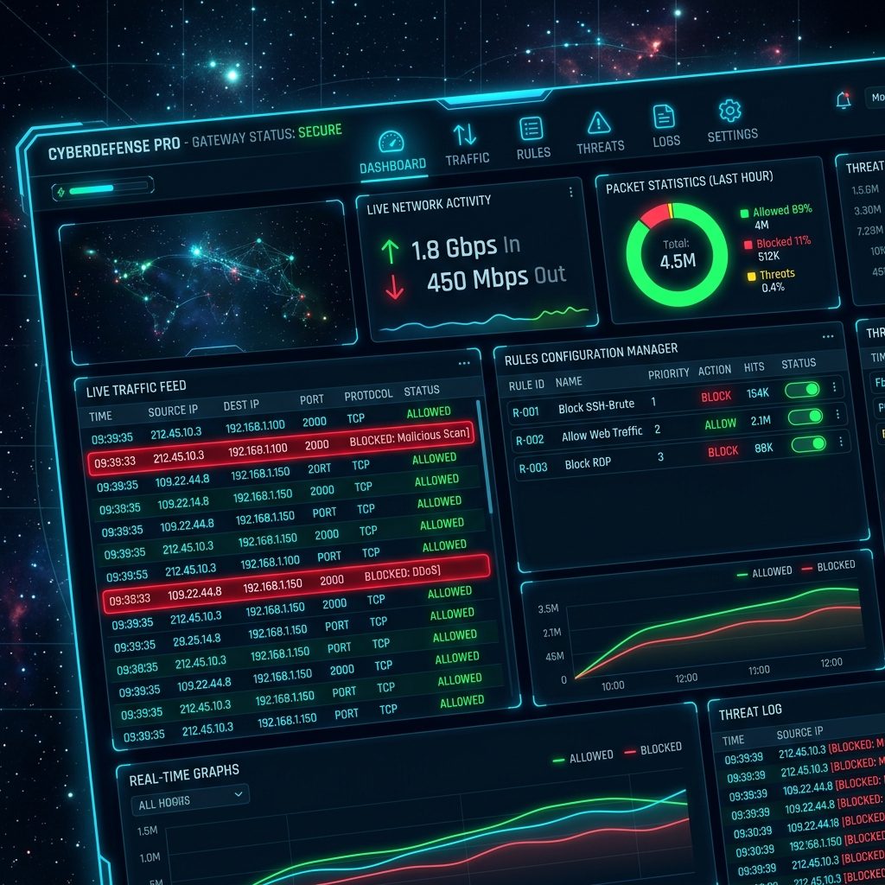

# Firewall-Simulator

A real-time rule-based network traffic filtering system that inspects incoming packets (IP, ports, protocols), evaluates them against user-defined prioritized rules, and provides a premium Glassmorphic dashboard showing what gets allowed/blocked and why.



## Directory Structure

```text
Firewall-Simulator/
│
├── app.py
├── config.py
├── rules.json
├── requirements.txt
│
├── engine/
│      filter_engine.py
│      rule_manager.py
│      logger.py
│
├── network/
│      packet_sniffer.py
│      packet_generator.py
│      packet_parser.py
│
├── static/
│      style.css
│      dashboard.js
│      chart.js
│
├── templates/
│      index.html
│
├── exports/
│      logs.csv
│      logs.json
│
├── tests/
│      test_filter.py
│
└── README.md
```

## Getting Started

1. **Install Dependencies**:
   Ensure you have Python installed, then run:
   ```bash
   pip install -r requirements.txt
   ```

2. **Run the Application**:
   Execute the Flask server from the root directory:
   ```bash
   python app.py
   ```
   Open your browser and load:
   [http://127.0.0.1:5000](http://127.0.0.1:5000)

3. **Running Tests**:
   To verify the filter engine logic (IP subnets, protocol parsing, rule priority orders):
   ```bash
   python -m unittest tests/test_filter.py
   ```
